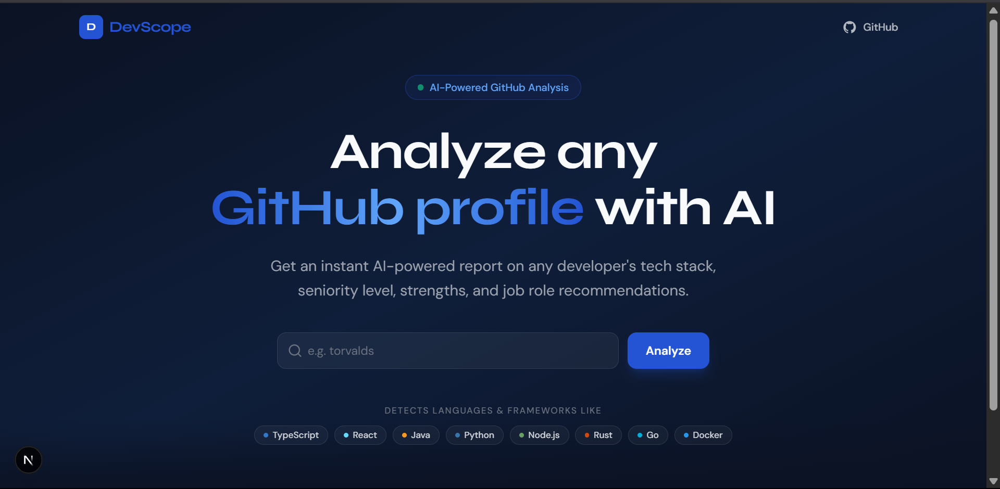

# DevScope 🔍

> AI-powered GitHub profile analyzer — get an instant technical report on any developer.



## What is DevScope?

DevScope analyzes any public GitHub profile and generates a detailed AI-powered developer report including:

- 🧠 **Seniority level** — Junior / Mid-Level / Senior / Expert with score 0-100
- 🛠️ **Tech stack breakdown** — primary, secondary, and missing skills
- ✅ **Strengths & weaknesses** — specific and constructive feedback
- 🚀 **Project highlights** — assessment of top repositories
- 💼 **Recommended job roles** — based on actual code and activity
- 💡 **Improvement suggestions** — actionable next steps

Built by **[Gninninmaguignon Silué](https://github.com/Gninho-silue)** — Full-Stack Developer & Cloud-Native Enthusiast.

---

## Tech Stack

| Layer      | Technology                           |
| ---------- | ------------------------------------ |
| Framework  | Next.js 14 (App Router)              |
| Language   | TypeScript (strict)                  |
| Styling    | Tailwind CSS + shadcn/ui             |
| AI         | Groq API — `llama-3.3-70b-versatile` |
| Data       | GitHub REST API v3                   |
| Animations | Framer Motion                        |
| Deployment | Vercel                               |

---

## Getting Started

### Prerequisites

- Node.js 18+
- A [Groq API key](https://console.groq.com) (free)
- A [GitHub Personal Access Token](https://github.com/settings/tokens) (optional, recommended)

### Installation

```bash
# 1. Clone the repository
git clone https://github.com/Gninho-silue/devscope.git
cd devscope

# 2. Install dependencies
npm install

# 3. Setup environment variables
cp .env.example .env.local
```

### Environment Variables

Edit `.env.local` with your keys:

```bash
# Required — get it free at console.groq.com
GROQ_API_KEY=gsk_xxxxxxxxxxxxxxxxxxxxxxxx

# Optional — increases GitHub rate limit from 60 to 5000 req/hr
# Get it at github.com/settings/tokens — only check "public_repo" scope
GITHUB_TOKEN=ghp_xxxxxxxxxxxxxxxxxxxxxxxx

NEXT_PUBLIC_APP_URL=http://localhost:3000
```

### Run Locally

```bash
npm run dev
# → http://localhost:3000
```

---

## Project Structure

```
devscope/
├── app/
│   ├── page.tsx                    # Home page
│   ├── analyze/[username]/         # Results page
│   └── api/
│       ├── github/route.ts         # GitHub data aggregation
│       └── analyze/route.ts        # Groq AI analysis
├── components/
│   ├── layout/                     # Navbar, Footer
│   ├── home/                       # HeroSection, SearchForm
│   ├── analysis/                   # ReportCard, SeniorityMeter, StackBadges, ProjectList
│   └── shared/                     # LoadingSpinner, GithubCard
├── lib/
│   ├── github.ts                   # GitHub API client
│   ├── groq.ts                     # Groq AI wrapper
│   └── prompts.ts                  # LLM prompt builder
├── types/
│   ├── github.ts                   # GitHub data types
│   └── analysis.ts                 # Analysis result types
└── hooks/
    └── useAnalysis.ts              # Analysis flow hook
```

---

## Git Workflow

This project follows **GitHub Flow** with Conventional Commits:

```bash
main                        # Production — always deployable
  └── feat/hero-section
  └── feat/github-api
  └── feat/claude-integration
  └── feat/results-page
  └── feat/analysis-report-ui
```

Every feature is developed on its own branch and merged via Pull Request. Direct commits to `main` are not allowed.

**Commit convention:**

```
feat: add new feature
fix: fix a bug
chore: tooling or config
docs: documentation only
refactor: code change, no feature
```

---

## Deployment

This app is deployed on **Vercel**.

[](https://vercel.com/new/clone?repository-url=https://github.com/Gninho-silue/devscope)

Add the following environment variables in your Vercel project settings:

- `GROQ_API_KEY`
- `GITHUB_TOKEN` (optional)
- `NEXT_PUBLIC_APP_URL` (your production URL)

---

## Author

**Gninninmaguignon Silué** — Full-Stack Developer | Java · React · Node.js · Cloud-Native

- 🌐 [Portfolio](https://silue-portfolio.vercel.app)
- 💼 [LinkedIn](https://linkedin.com/in/gninema-silue)
- 🐙 [GitHub](https://github.com/Gninho-silue)
- 📧 gninninmaguignonsilue@gmail.com

---

## License

MIT — free to use, fork, and build upon.

---

_"Code with logic, build with purpose, learn with curiosity."_
